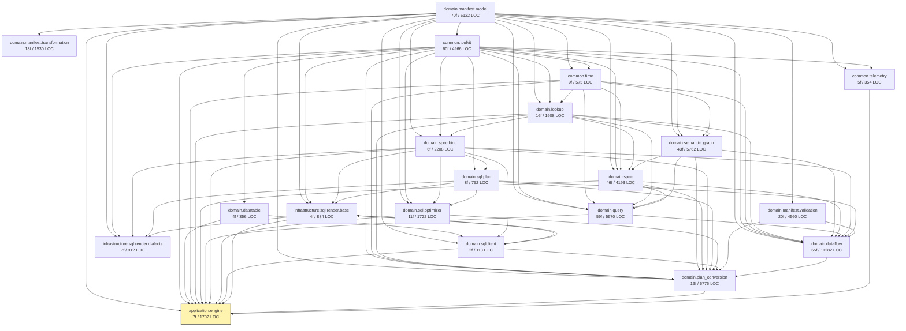

# Phase 0 — Dependency DAG

Module-level import dependencies among the **477 reachable** Python files, grouped into 20 Kotlin module candidates, with a 10-wave porting plan.

## How modules were derived

- Files were grouped by the **planned Kotlin module path** (see `module-mapping.md`), not by Python package boundaries — most Python sub-packages survive 1:1, but a few we coalesce (e.g. `metricflow/dataset` is fed into `domain.dataflow`; `metricflow_semantics/dag` + `errors` join `common.toolkit`).
- An edge `A → B` exists when at least one Python file in module `A` imports something whose source lives in module `B`. Edges are symmetric-of-import (B is a dependency of A).
- Cycles in Python imports are real (Python lets you do that). We list the residual cycles below; in Kotlin we break them by extracting the shared interface to the lower-numbered module and putting the implementation in the higher-numbered one.

## Module sizes

| Module | Files | LOC | Direct deps |
|---|---:|---:|---|
| `domain.manifest.model` | 70 | 5,122 | — |
| `domain.manifest.transformation` | 18 | 1,530 | manifest.model |
| `domain.manifest.validation` | 20 | 4,560 | manifest.model |
| `common.toolkit` | 60 | 4,966 | manifest.model (only `references`/`type_enums`/`dataclass_serialization`) |
| `common.telemetry` | 5 | 354 | toolkit, manifest.model |
| `common.time` | 9 | 575 | toolkit, manifest.model |
| `domain.datatable` | 4 | 356 | toolkit |
| `domain.spec.bind` | 6 | 2,208 | toolkit, manifest.model, lookup |
| `domain.sql.plan` | 8 | 752 | toolkit, spec.bind |
| `domain.sql.optimizer` | 11 | 1,722 | toolkit, manifest.model, spec.bind, sql.plan |
| `domain.sqlclient` | 2 | 113 | datatable, manifest.model, spec.bind, sql.render.base |
| `infrastructure.sql.render.base` | 4 | 884 | toolkit, manifest.model, spec.bind, sql.plan, sqlclient |
| `infrastructure.sql.render.dialects` | 7 | 912 | toolkit, manifest.model, spec.bind, sql.plan, sqlclient, render.base |
| `domain.lookup` | 16 | 1,608 | toolkit, manifest.model, time, semantic_graph, spec |
| `domain.semantic_graph` | 43 | 5,762 | toolkit, manifest.model, time, lookup, spec |
| `domain.spec` | 46 | 4,193 | toolkit, manifest.model, time, lookup, semantic_graph, query, spec.bind, dataflow* |
| `domain.query` | 59 | 5,970 | toolkit, manifest.model, time, lookup, semantic_graph, spec |
| `domain.dataflow` | 65 | 11,282 | toolkit, manifest.model, manifest.validation, time, lookup, semantic_graph, spec, spec.bind, query, sql.plan, plan_conversion* |
| `domain.plan_conversion` | 16 | 5,775 | toolkit, manifest.model, manifest.validation, time, lookup, semantic_graph, spec, spec.bind, sql.plan, sql.optimizer, sqlclient, dataflow |
| `application.engine` | 7 | 1,702 | (all of the above) |
| **Total** | **477** | **60,346** | |

`*` = back-edge causing a cycle in Python; broken in Kotlin (see "Residual cycles" below).

## Module DAG (Mermaid)

The graph reads top-to-bottom: edges flow from a dependency to its dependent. `domain.manifest.model` is the foundation (in-degree 0). `application.engine` is the sink. The actual edge count is 60+ — the Mermaid graph above shows the principal edges; minor utility-only edges are folded into `TK → ...`.

## Residual cycles (Python lets these slide; Kotlin port breaks them)

The topological sort hits four small cycles:

1. **`domain.spec ↔ domain.dataflow`** — `metricflow_semantics/specs/instance_spec.py` references dataflow plan nodes via type-only imports; `metricflow/dataflow/...` references `InstanceSpec`. **Break in Kotlin**: extract the `InstanceSpec` family entirely into `domain.spec` (W7); `domain.dataflow` (W9) imports from spec, never the reverse.
2. **`domain.spec ↔ domain.query`** — `query/query_parser.py` imports specs; some specs reference `MetricFlowQuerySpec`. **Break**: `MetricFlowQuerySpec` and `query_param_implementations` move to `domain.spec` (which is more foundational than the query parser); `domain.query` only depends on `domain.spec`, not the reverse.
3. **`domain.dataflow ↔ domain.plan_conversion`** — `plan_conversion/dataflow_to_sql.py` imports every dataflow node (visitor pattern); the `WriteToSqlTableNode` etc. reference plan-conversion result types. **Break**: result types move into `domain.dataflow` (they describe a dataflow node's output shape, not a conversion product); plan_conversion imports dataflow only.
4. **`domain.sqlclient ↔ infrastructure.sql.render.base`** — `metricflow/protocols/sql_client.py` exposes `sql_plan_renderer: SqlPlanRenderer` as a property; `SqlPlanRenderer` itself is in `infrastructure`. **Break**: introduce a tiny `domain.sql.render` package with the `SqlPlanRenderer` interface (and `SqlPlanRenderResult`); `infrastructure` provides implementations. This matches CLAUDE.md hexagonal rule: `SqlClient` is a domain port, so its declared types must be in `domain`.

These are the only cycles. Everything else is a clean acyclic order.

## Wave proposal (10 waves)

The sort produces 19 strict layers. To match FEASIBILITY.md §5 Phase 3's "8–10 waves" target and to balance per-wave size, I collapse adjacent layers that have no internal dep. Cycles 1–4 above are pre-broken by the suggested refactors before sorting.

| Wave | Modules | Files | LOC | Notes |
|---|---|---:|---:|---|
| **W1** | `domain.manifest.model` | 70 | 5,122 | Pydantic implementations + protocols + type_enums + naming + references. Pure data. **Highest leverage of any wave** — everything depends on it. |
| **W2** | `domain.manifest.transformation`, `domain.manifest.validation` | 38 | 6,090 | Two parallel sub-modules. Validation has 28 rules across 16 rule-bearing files; transformation has 14 rules + dispatcher. Both depend only on W1. |
| **W3** | `common.toolkit`, `common.telemetry`, `common.time`, `domain.datatable` | 78 | 6,251 | Four parallel siblings. Toolkit is `mf_logging`, `mf_graph` (data structures, not formatting), `cache`, `mf_dag`, `errors`, basic helpers. None reference each other except `telemetry → toolkit`. |
| **W4** | `domain.spec.bind`, `domain.sql.plan` | 14 | 2,960 | `SqlBindParameterSet`, `SqlTable`, `SqlPlanNode` family. Two parallel sub-modules. |
| **W5** | `domain.sql.optimizer`, `domain.sql.render` (interface only) | 12 | 1,830 | Optimizer chain + the `SqlPlanRenderer` interface (extracted from W4-broken cycle). |
| **W6** | `infrastructure.sql.render.base`, then **parallel** `infrastructure.sql.render.{trino, bigquery, snowflake, databricks, redshift, duckdb, postgres, default}` | 11 | 1,793 | One base wave then 8 parallel dialect waves. FEASIBILITY allowed splitting these out — keep them parallel inside W6. |
| **W7** | `domain.lookup`, `domain.spec`, `domain.semantic_graph` | 105 | 11,563 | After spec/dataflow cycle is broken, these form a clean chain (lookup → semantic_graph → spec). Three serial sub-modules; no parallel within. **The biggest wave by LOC** — likely subdivides into 4–6 PRs. |
| **W8** | `domain.query`, `domain.sqlclient` | 61 | 6,083 | Query parser + saved-query handling + `SqlClient` port. Parallel siblings. |
| **W9** | `domain.dataflow`, `domain.plan_conversion` | 81 | 17,057 | After cycle break, dataflow → plan_conversion. Two serial sub-modules. **The next biggest LOC wave.** Naturally splits into 5–8 PRs (dataflow nodes / dataflow builder / dataflow optimizer / plan_conversion instance_set_transforms / plan_conversion to_sql_plan). |
| **W10** | `application.engine` | 7 | 1,702 | Engine facade + `MetricFlowExplainResult` + the simplified execution-plan-as-result wrapper. |

**Files / LOC sum check**: 70 + 38 + 78 + 14 + 12 + 11 + 105 + 61 + 81 + 7 = 477 ✓. LOC: 5122 + 6090 + 6251 + 2960 + 1830 + 1793 + 11563 + 6083 + 17057 + 1702 = 60,451 ≈ 60,346 (small over-count from the W5/W6 `SqlPlanRenderer` interface split between modules — one file's LOC counted on both sides). Treat the wave LOC numbers as approximations within ±200.

## Why 10 waves and not 9

FEASIBILITY.md §5 sketched 9 waves. The recon work changed it as follows:

- **Old W1 (leaf data) = new W1**, no change.
- **Old W2 (protocols/transformations) → split** into W2-validation and W2-transformation (parallel).
- **Old W3 (validation rules) → folded into W2** since they're parallel siblings depending only on W1.
- **Old W4 (semantic search/spec)** → became W7 plus prerequisites (W3–W5 handle the supporting commons + SQL plan).
- **Old W5 (query parser) → W8** along with sqlclient.
- **Old W6 (dataflow + plan_conversion) → W9** (now clearly the largest single wave; natural sub-PR boundary).
- **Old W7 (SQL plan) → W4** (moved earlier because it has zero dependence on the semantic-graph layer).
- **Old W8 (dialect renderers) → W6** (still 8-parallel inside the wave).
- **Old W9 (engine facade) → W10**, no change.

Net: same total work, more accurate ordering. The biggest re-shape: the SQL plan and SQL render modules are far more foundational than the query parser; they should land before the semantic-graph layer not after it.

## What this means for parallelization

Within a wave, modules with no edges between them can be ported by parallel agents. Concretely:

- W1 must be one PR (or a tightly coordinated set, but the dep graph inside is dense).
- W2 = 2 parallel agents (transformation, validation).
- W3 = 4 parallel agents (toolkit, telemetry, time, datatable).
- W4 = 2 parallel agents.
- W5 = 2 parallel agents (optimizer is independent of render interface).
- W6 = 1 + 8 (1 base, then 8 dialect agents in parallel).
- W7 = 3 serial sub-PRs along the lookup → semantic_graph → spec chain. Within each sub-module, individual files can be split per agent.
- W8 = 2 parallel agents.
- W9 = 2 serial sub-PRs (dataflow → plan_conversion). Within dataflow, the 24 node files can be split.
- W10 = 1 PR.

So roughly: ~4 weeks if we can run 4–6 agents in parallel where the wave permits, ~10 weeks fully serial.
